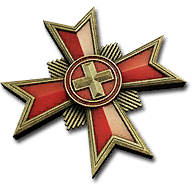
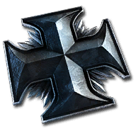
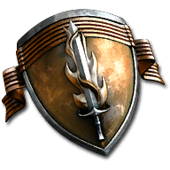
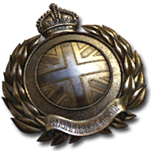

# Intro
This Discord bot is currently under development.
The bot is being tested on https://discord.com/invite/coh2org.

Replay parsing is based on Ryan Tailor's excellent libraries: [ryantaylor/vault](https://github.com/ryantaylor/vault) and [ryantaylor/flank](https://github.com/ryantaylor/flank).

# Installation
- Bot authentication link: https://discord.com/api/oauth2/authorize?client_id=753206700655378523&permissions=321600&scope=bot
    | Scope | Purpose |
    |-------|---------|
    |`Send Messages`| Send replay info embeds. |
    |`Manage Messages`| Manage reactions added to a replay embed (chat expansion). |
    |`Embed Links`| Embed markdown links (chat expansion link). |
    |`Attach Files`| Attach map preview images to embeds. |
    |`Use External Emojis`| Use standalone CoH2 faction emojis from the bot's "home" Discord server:       |
    |`Add Reactions`| Add chat expansion reaction to a replay embed. |
    
- ❤️ Please consider inviting `Janne252#7736` to the server(s) the bot has been added to ❤️
# TODO
- [x] Set activity status message periodically, e.g. every 60 minutes (appears to disappear/clear after some time)
- [ ] See if `"{0}_mm_preview_high.tga"` should have a higher priority than `"{0}_mm_preview.tga"` (Higher resolution, still the same artistic render of the tactical map)
- [x] Use full scenario paths for identifying preview images. Replace path separators with underscores.
- [x] Preview image generation step should empty the destination directory before outputting any files.
- [ ] Show player loadouts?
    - [ ] Commanders
    - [ ] Intel bulletins (likely not relevant)
    - [ ] Skins (likely not relevant)
- [x] Show match length
    - Really not a spoiler as it's both displayed in the list of replays and in-game.
    - Implemented using Discord's spoiler tag
- [x] Show chat?
    - How do we limit the number of lines; The embed likely cannot scroll overflowing content.
    - Perhaps there is a markdown notation for code / quote blocks with scrolling?
    - Considered a spoiler; Chat often reveals the winning player.
    - Maybe a bot command to include chat?
    - Can probably be rendered with a spoiler tag, has to be limited to 1024 characters similar to other embed fields.
- [x] render map images with resource & strategic point icons overlay
    - This algorithm can be copied from https://github.com/Janne252/coh2-tactical-map-icons-renderer
- [x] Test with custom maps. If the Steam Workshop item id is present in the replay data somehow, we might be able to fetch the image from Steam (Open Graph meta tags).
    - Owner of the map who uses a local copy likely won't have this data present, but it's a minor inconvenience. And it's known!
    - Nope, cannot be done. The replay file contains the asset path of the map.
- [x] Add a status message to the bot
- [x] `try(parse replay)` ... `finally (try delete downloaded file)`
- [ ] Handle replay data parser errors. Currently does not affect the bot as players and map info are still parsed.
    - Wikinger mod discord has several mod replay files that will likely recreate this error.
- [ ] Figure out a better way of signaling handled messages than boolean
- [ ] "Self-made" configuration system (loads package.json via JSON.parse and takes a section of it) works but probably isn't the best way of doing things
    - Separate config file?
- [ ] Admin commands written in the mobile version of Discord don't appear to work / register
- [ ] Localize replay duration with moment (refactor to use moment)
# License
[MIT License](./LICENSE.txt)
