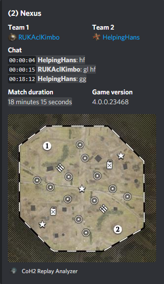

# Intro
This Discord bot processes Company of Heroes 2 replay files (`.rec`) that users have attached to their messages.
The bot provides a summary of the replay's details:
- Map name
- Map tactical map image
- Players (names, factions, links to their leaderboard profiles,)
- Chat
- Match duration
- Game version

The bot also has a mode for creating compact less verbose embeds, where the summary details are:
- Map name
- Map tactical map image (as a small thumbnail image)
- Players (names, factions, links to their leaderboard profiles,)
- Match duration

This mode is controlled by the `Manage Messages` permission or by the message content (set the "add a comment" field to `compact`). To enable the compact mode, disable `Manage Messages` permission in the bot role permissions (global) or in the channel bot role permissions (per channel). 

Replay parsing is based on Ryan Tailor's excellent libraries: [ryantaylor/vault](https://github.com/ryantaylor/vault) and [ryantaylor/flank](https://github.com/ryantaylor/flank).

# Installation
- Bot authentication link: https://discord.com/api/oauth2/authorize?client_id=753206700655378523&permissions=321600&scope=bot
    | Scope | Purpose |
    |-------|---------|
    |`Send Messages`| Send replay info embeds. |
    |`Manage Messages`| Manage reactions added to a replay embed (chat expansion). |
    |`Embed Links`| Embed markdown links (chat expansion link). |
    |`Attach Files`| Attach map preview images to embeds. |
    |`Use External Emojis`| Use standalone CoH2 faction emojis from the bot's "home" Discord server:       |
    |`Add Reactions`| Add chat expansion reaction to a replay embed. |
    
- ❤️ Please consider inviting `Janne252#7736` to the server(s) the bot has been added to ❤️
# TODO
- [ ] See if `"{0}_mm_preview_high.tga"` should have a higher priority than `"{0}_mm_preview.tga"` (Higher resolution, still the same artistic render of the tactical map)
- [ ] Show player loadouts?
    - [ ] Commanders
    - [ ] Intel bulletins (likely not relevant)
    - [ ] Skins (likely not relevant)
- [x] Test with custom maps. If the Steam Workshop item id is present in the replay data somehow, we might be able to fetch the image from Steam (Open Graph meta tags).
    - Owner of the map who uses a local copy likely won't have this data present, but it's a minor inconvenience. And it's known!
    - Nope, cannot be done. The replay file contains the asset path of the map.
- [ ] Handle replay data parser errors. Currently does not affect the bot as players and map info are still parsed.
    - Wikinger mod discord has several mod replay files that will likely recreate this error.
- [ ] Figure out a better way of signaling handled messages than boolean
- [ ] "Self-made" configuration system (loads package.json via JSON.parse and takes a section of it) works but probably isn't the best way of doing things
    - Separate config file?
# License
[MIT License](./LICENSE.txt)
