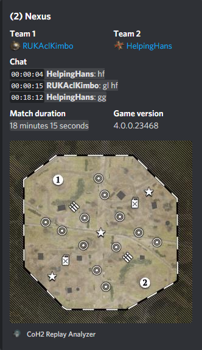
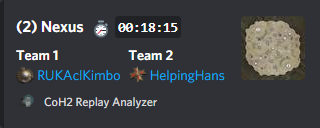
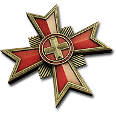
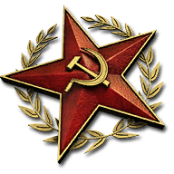
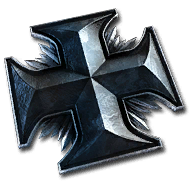
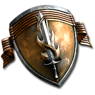
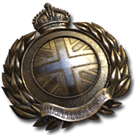

# Intro
This Discord bot processes Company of Heroes 2 replay files (`.rec`) that users have attached to their messages.
The bot provides a summary of the replay's details:
- Map name
- Map tactical map image
- Players (names, factions, links to their leaderboard profiles)
- Chat
- Match duration
- Game version
- Chosen commanders

The bot also has a mode for creating compact, less verbose embeds, where the summary details are:
- Map name
- Map tactical map image (as a small thumbnail image)
- Players (names, factions, links to their leaderboard profiles,)
- Match duration

This mode is controlled by the `Manage Messages` permission or by the message content (set the "add a comment" field to `compact`). To enable the compact mode, disable `Manage Messages` permission in the bot role permissions (global) or in the channel bot role permissions (per channel). 

Replay parsing is based on Ryan Tailor's excellent libraries: [ryantaylor/vault](https://github.com/ryantaylor/vault) and [ryantaylor/flank](https://github.com/ryantaylor/flank).

# Installation
- Bot authentication link: https://discord.com/api/oauth2/authorize?client_id=753206700655378523&permissions=321600&scope=bot
    | Scope | Purpose |
    |-------|---------|
    |`Send Messages`| Send replay info embeds. |
    |`Manage Messages`| Manage reactions added to a replay embed (chat expansion). |
    |`Embed Links`| Embed markdown links (chat expansion link). |
    |`Attach Files`| Attach map preview images to embeds. |
    |`Use External Emojis`| Use standalone CoH2 faction emojis from the bot's "home" Discord server:       |
    |`Add Reactions`| Add chat expansion reaction to a replay embed. |
    
- ❤️ Please consider inviting `Janne252#7736` to the server(s) the bot has been added to ❤️

# Custom maps
Custom map support is based on a curated list of maps in [`custom-scenarios.json`](data-generator/custom-scenarios.json). 
To add a new custom map to the list, either open a pull request that targets `custom-scenarios.json` (preferred) or open an issue.

# TODO
- [x] See if `"{0}_mm_preview_high.tga"` should have a higher priority than `"{0}_mm_preview.tga"` (Higher resolution, still the same artistic render of the tactical map)
- [ ] Handle replay data parser errors. Currently does not affect the bot as players and map info are still parsed.
    - Wikinger mod discord has several mod replay files that will likely recreate this error.
- [ ] Figure out a better way of signaling handled messages than boolean
- [ ] "Self-made" configuration system (loads package.json via JSON.parse and takes a section of it) works but probably isn't the best way of doing things
    - Separate config file?
# License
[MIT License](./LICENSE.txt)
